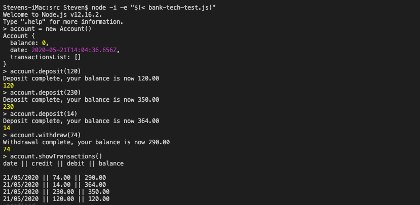

# bank-tech-test

**This week at Makers we needed to build a simple bank account app**
We were informed we did not need to link the app to a database or implement a command-line interface that takes input from STDIN. 

**The user story was as follows**

**Given** a client makes a deposit of 1000 on 10-01-2012  
**And** a deposit of 2000 on 13-01-2012  
**And** a withdrawal of 500 on 14-01-2012  
**When** she prints her bank statement  
**Then** she would see
```
date || credit || debit || balance
14/01/2012 || || 500.00 || 2500.00
13/01/2012 || 2000.00 || || 3000.00
10/01/2012 || 1000.00 || || 1000.00
```
**How to run**
1) In order to run the application first clone the repo

``` git clone git@github.com:Steven-Klavins/bank-tech-test.git ```

2) Following this navigate to the **SpecRunner.htmlSpecRunner.html** and open it in Chrome,
open Chromes consol. The Chrome console can be accessed by right-clicking on the page, and selecting inspect,
following this a consol tab will be available. 

3) That's it, your good to go!

**Here is the app in use**


**The Commands**

**new Account()** 

``` account new Account() ```


Creates a new instance of a users account, you can tailor this to your desired name (steven new Account()). The account will created with a balence of '0' and the date by default is set to 20/05/2020, you can set this to upate automatically by removing the string from the date field. I have left a note in the code next to this field, you can find this in the file directory ***src/bank-tech-test.js***

For the purposes of this walkthrough im using the account name 'account'

**account.withdraw**

``` account.withdraw() ```

You can use the withdraw method in order to withdraw money from the account, however, you will receive an error specifying there are not sufficient funds if you havent yet made a deposit. Enter the value to withdraw in the following format (account.withdraw(10)), this will withdraw 10.00 dollars/pounds/rupees, no specific currency is specified.

**account.deposit**

``` account.deposit() ```

This feature runs in the exact same manner as withdraw however, as you could most likely guess it adds money to the account apose to subtracting it. 

**account.showTransactions**

``` account.showTransactions() ```

Running this command will log a table to your console showing all transactions that have been made in the duration of your session, as this program does not have a database keep in mind they won't be preserved if you start a new session.  

**About**

This project was created using Javascript and the Jasmine standalone testing framework and was designed leading with TDD principles. Throughout this project piece by piece I refactored the code in order to make my tests pass, I tried my best to ensure no piece of code was dependent on another. The only scenarios where code is coupled is formatting purposes which I believe to be a suitable design choice


